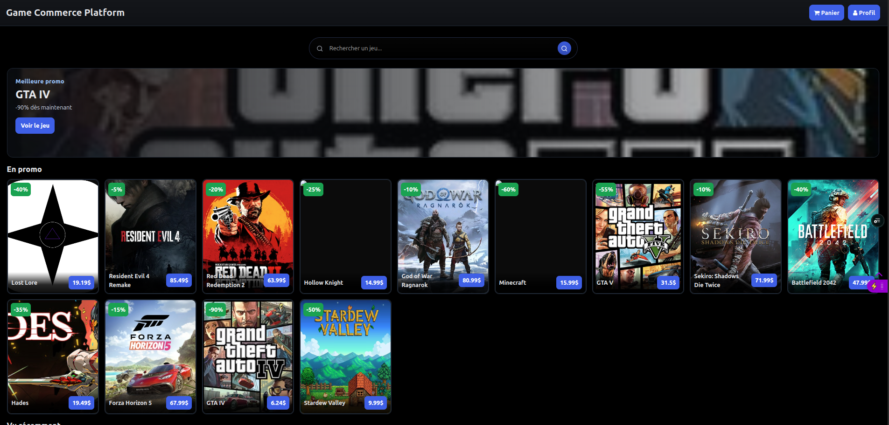
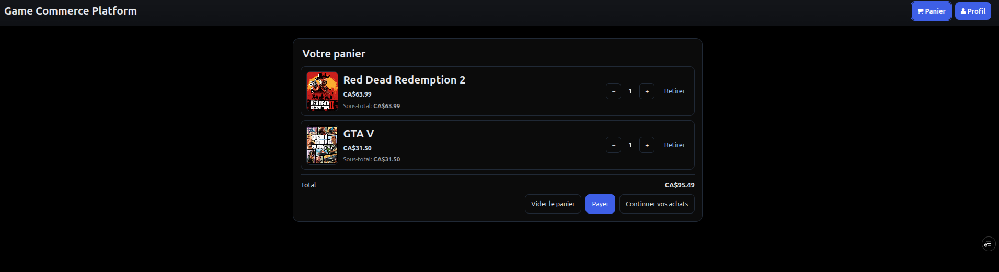
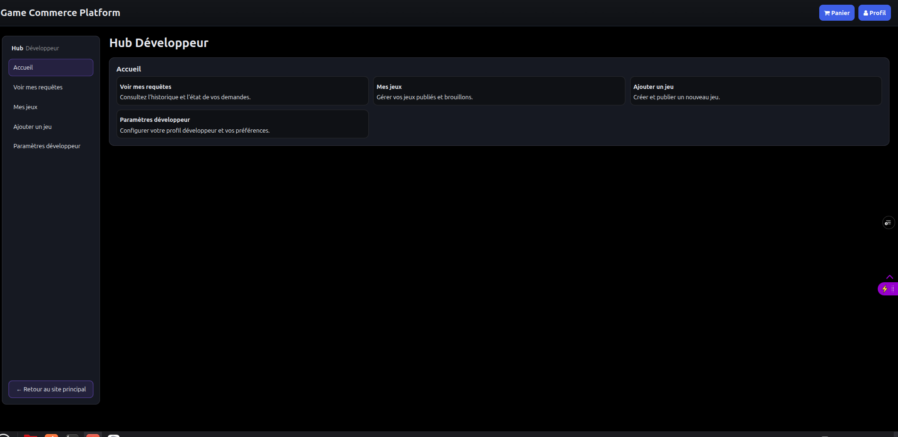

# Game Commerce Platform

A full-stack e-commerce platform for browsing and purchasing digital games. It includes user authentication, a shopping cart, Stripe checkout, role-based dashboards and catalogue management.

## Live demo

[View the deployed application](https://instant-gooning-v1.vercel.app/)

## Screenshots

### Game catalogue



### Shopping cart



### Developer dashboard



## Main features

### Customer features

- User registration and authentication.
- JWT-based authorization for protected routes.
- Game catalogue and individual product pages.
- Shopping cart with quantity management.
- Secure checkout through Stripe.
- User account and profile management.

### Developer and administrator features

- Developer dashboard for managing published games and drafts.
- Game creation and publication workflow.
- Administrative review system.
- Administrative catalogue management.
- Role-based access to protected features.

### Backend features

- Express API with structured routes, controllers and middleware.
- Supabase integration for data storage and account information.
- Stripe Checkout integration.
- Stripe webhook processing for completed payments.
- Input validation and password hashing.
- Rate limiting for authentication and sensitive operations.

## Technology stack

| Area | Technologies |
|---|---|
| Frontend | React, Vite, React Router |
| Backend | Node.js, Express |
| Database and authentication | Supabase |
| Payments | Stripe |
| Security | JWT, bcrypt, input validation, rate limiting |
| Testing | Vitest, Cypress, Testing Library |
| Deployment | Vercel |
| Code quality | ESLint |

## High-level architecture

- `src/` — React client application.
- `server/` — Express API, business logic, middleware and route handlers.
- `api/index.js` — Serverless-compatible entry point for Vercel.
- `server/config/supabase.js` — Public and server-side Supabase configuration.
- `server/controllers/stripeWebhookController.js` — Stripe webhook event handling.
- `cypress/` — End-to-end testing files.
- `.github/workflows/` — Automated GitHub workflows.

## My contribution

This application was originally developed as a team project.

Mathéo Lacerte was the primary contributor and completed approximately 80% of the project. His main responsibilities included:

- Designing and developing the Express backend.
- Implementing JWT authentication and protected routes.
- Integrating Supabase and working on the database.
- Integrating Stripe Checkout and payment webhooks.
- Building the administrative and developer features.
- Developing most of the game catalogue.
- Contributing to the application interface.
- Configuring and deploying the application on Vercel.
- Improving security, testing and repository documentation.

## Local installation

### Requirements

- Node.js 22 or later.
- npm.
- A Supabase project.
- A Stripe account for payment testing.

### Instructions

1. Clone the repository:

   ```bash
   git clone https://github.com/matheo-lacerte/game-commerce-platform.git
   cd game-commerce-platform
   ```

2. Install the dependencies:

   ```bash
   npm ci
   ```

3. Copy the environment template:

   ```bash
   cp .env.example .env
   ```

4. Add your own development credentials to `.env`.

5. Start the React development server:

   ```bash
   npm run dev
   ```

6. In another terminal, start the Express API:

   ```bash
   npm run dev:server
   ```

## Environment variables

The repository contains an `.env.example` file with placeholder values.

### Public and runtime configuration

- `SUPABASE_URL`
- `SUPABASE_ANON_KEY`
- `NEXT_PUBLIC_SUPABASE_URL`
- `NEXT_PUBLIC_SUPABASE_PUBLISHABLE_KEY`
- `SITE_URL`
- `DEFAULT_CURRENCY`
- `PORT`
- `CORS_ORIGINS`

### Server-only secrets

- `SUPABASE_SERVICE_ROLE_KEY`
- `STRIPE_SECRET_KEY`
- `STRIPE_WEBHOOK_SECRET`
- `JWT_SECRET`

Never expose server-only credentials in frontend code or commit them to the repository.

## Available commands

| Command | Description |
|---|---|
| `npm run dev` | Start the Vite development server |
| `npm run build` | Build the frontend for production |
| `npm run preview` | Preview the production build |
| `npm run server` | Start the Express API |
| `npm run dev:server` | Start the Express API with Nodemon |
| `npm run lint` | Run ESLint |
| `npm test` | Run the Vitest test suite |
| `npm run test:coverage` | Run tests and generate coverage results |

## Testing

Run the unit and component tests:

```bash
npm test
```

Generate a coverage report:

```bash
npm run test:coverage
```

Cypress end-to-end tests are also included and can be executed once the frontend and backend development environments are running.

## Deployment

The project is configured for deployment on Vercel.

- `vercel.json` manages API and single-page application routing.
- `api/index.js` exposes the Express application as a serverless entry point.
- Production environment variables must be configured through the Vercel project settings.
- Stripe webhooks must point to the production webhook endpoint.

## Security practices

- Server-only secrets are stored in environment variables.
- `.env` files are excluded through `.gitignore`.
- `.env.example` contains placeholders only.
- Passwords are hashed with bcrypt.
- Protected routes use JWT-based authorization.
- Authentication and write operations use rate limiting.
- Inputs are validated before sensitive operations.
- CORS origins can be restricted through `CORS_ORIGINS`.
- Secret scanning should be performed before each public release.

## Possible future improvements

- Run Cypress end-to-end tests automatically through CI.
- Add audit logging for administrative actions.
- Improve monitoring and alerting for payment events.
- Improve internationalization across frontend and backend messages.
- Expand automated integration test coverage.
